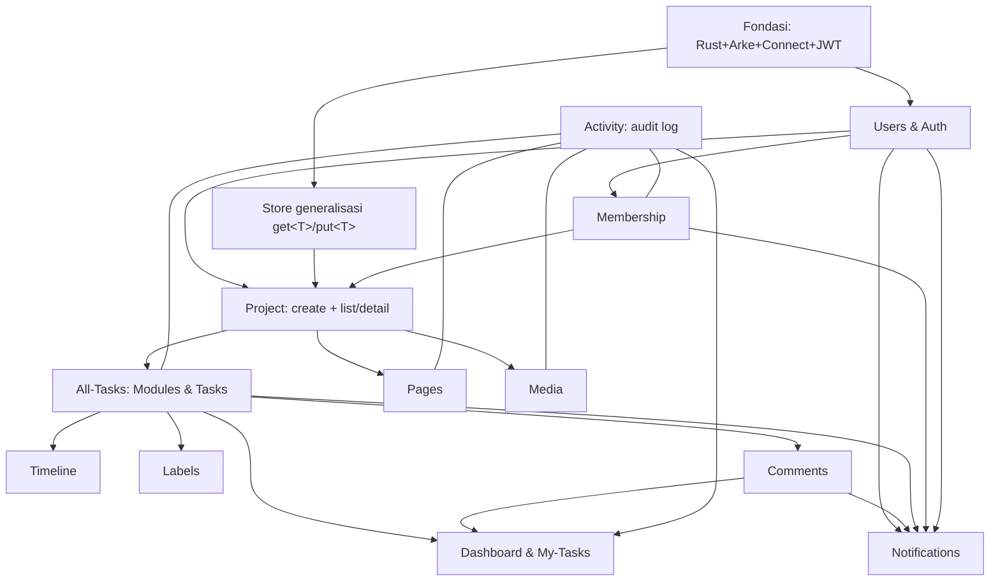

# Peta Dependensi & Urutan Implementasi

- **Tanggal:** 2026-07-29
- **Tujuan:** Menautkan 14 dok flow menjadi satu graf ketergantungan + urutan build yang aman (fondasi dulu, agregasi terakhir).
- **Kontrak gabungan:** [`../proto/sedjiwa_tasks.v1.proto`](../proto/sedjiwa_tasks.v1.proto) (satu package `sedjiwa.tasks.v1`).

---

## 1. Graf Ketergantungan

- **Garis padat** = ketergantungan keras (butuh yang ditunjuk lebih dulu).
- **Garis putus** (Activity) = **cross-cutting emit**: helper `record_activity` di-*land* lebih awal sebagai no-op-capable, lalu tiap flow sumber memanggilnya saat ia jadi.
- **Notifications** juga cross-cutting (emit dari Comments/All-Tasks/Members/Auth) — helper `emit_notification` no-op-capable dulu.

## 2. Urutan Build (bertahap, tiap fase menghasilkan sesuatu yang jalan)

| Fase | Flow | Kenapa di sini | Dok |
|---|---|---|---|
| **0** | **Fondasi (walking skeleton)** | Membuktikan tumpukan; semua bergantung padanya. Ada plan TDD. | [foundation](./2026-07-29-platform-foundation-design.md) · [plan](../plans/2026-07-29-platform-foundation.md) |
| **1** | **Store generalisasi** (`get<T>`/`put<T>`) | Utang teknis fondasi §12 no.6; prasyarat semua entity. | foundation §5 |
| **2** | **Users & Auth** | Menerbitkan JWT + direktori user; picker owner/assignee/member butuh ini. | [users-auth](./2026-07-29-users-auth-flow-design.md) |
| **3** | **Membership** + **Project (create + list/detail)** | Membership dipakai auto-add (create) & scope (list); jadi satu fase dgn project. | [create](./2026-07-29-create-project-flow-design.md) · [list-detail](./2026-07-29-project-list-detail-flow-design.md) · [members](./2026-07-29-project-members-tab-flow-design.md) |
| **4** | **All-Tasks (Modules & Tasks)** | Inti kerja; fondasi tab lain. Land helper `record_activity`/`emit_notification` di sini. | [all-tasks](./2026-07-29-project-all-tasks-tab-flow-design.md) |
| **5** | **Labels**, **Comments** | Melengkapi task. Comments menyalakan emit notifikasi mention. | [labels](./2026-07-29-labels-palette-flow-design.md) · [comments](./2026-07-29-comments-flow-design.md) |
| **6** | **Notifications** (in-app + stream) | Setelah ada emit dari task/comment/member/auth. | [notifications](./2026-07-29-notifications-flow-design.md) |
| **7** | **Activity** (query sisi baca) | Emit sudah tersebar sejak fase 4; kini bangun read (`ListProject/Entity/Recent`). | [activity](./2026-07-29-activity-feed-flow-design.md) |
| **8** | **Pages**, **Media**, **Timeline** | Tab tambahan; Timeline butuh Task dates. | [pages](./2026-07-29-project-pages-tab-flow-design.md) · [media](./2026-07-29-project-media-tab-flow-design.md) · [timeline](./2026-07-29-project-timeline-tab-flow-design.md) |
| **9** | **Dashboard & My-Tasks** | Agregasi lintas-projek; butuh task/comment/activity matang. | [dashboard](./2026-07-29-dashboard-my-tasks-flow-design.md) |

## 3. Keputusan Terbuka Lintas-Flow (terpusat)

Dirujuk oleh banyak dok; diselesaikan di fondasi saat relevan:

1. **Cache hasil-query + invalidasi silang** (fondasi §12 no.5) — memengaruhi `ListProjects` (list/detail §6), agregasi Dashboard (§5). *Mulai tanpa cache.*
2. **Fan-out real-time multi-instance** (fondasi §12 no.4) — memengaruhi Notifications `StreamNotifications` (§6). *Mulai single-instance; LISTEN/NOTIFY saat scale.*
3. **`Store` generalisasi** (fondasi §12 no.6) — prasyarat fase 3+.
4. **Migrasi data lama** (Core/Bun → Rust) — dok tersendiri; belum dijadwalkan.

## 4. Catatan Kontrak (`.proto` gabungan)

- **Satu package `sedjiwa.tasks.v1`**, satu file — tak ada import lintas-package.
- **`ProjectService` digabung** dari 3 dok (create/list-detail/members) — bukan konflik.
- **Nilai enum di-prefix** agar unik dalam satu package proto3 (mis. `EntityType.ENTITY_TASK`, `MediaStatus.MEDIA_PENDING` — beda dari teks per-dok yang memakai `TASK`/`PENDING` dalam scope terpisah). `.proto` gabungan adalah **sumber kebenaran** bila berbeda dari cuplikan per-dok.
- **`MyTask`/`MyTasksResponse`** didefinisikan sekali; `GetUpcomingDeadlines` memakainya (bukan `TaskListResponse` terpisah).
